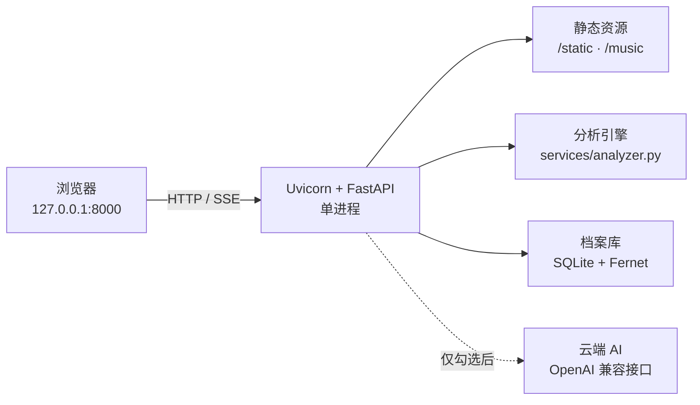
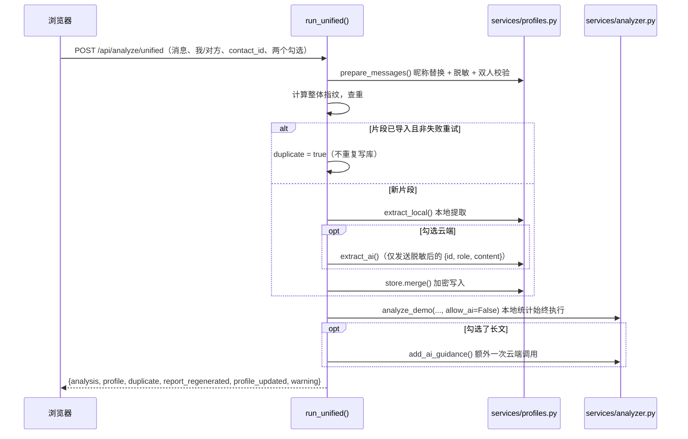

# Joker Detector Pro 技术文档

> 面向新加入的协作者 / 评审者 / 答辩老师，用一份文档讲清这个项目**想解决什么问题、做成了什么、怎么做的、边界在哪**。
>
> 阅读顺序建议：先看 [1. 项目概况](#1-项目概况) 和 [3. 功能总览](#3-功能总览) 建立印象，再按需深入 [4. 核心算法](#4-核心算法) 与 [5. 隐私与安全设计](#5-隐私与安全设计)。
>
> 面向使用者的操作说明见 [`README.md`](README.md)；联系人档案的详细规则见 [`docs/PROFILES.md`](PROFILES.md)。本文件是**技术与架构视角**的补充。

| 元信息 | 值 |
| --- | --- |
| 项目名 | Joker Detector Pro（站点名：交心 · 思源湖研究所） |
| 应用版本 | `2.2.0-experimental`（`backend/app/core/config.py` 的 `APP_VERSION`，由 `backend/app/main.py` 传给 FastAPI） |
| 性质 | 工程学导论课程项目，单机实验版 |
| 许可 | MIT（见 [`LICENSE`](LICENSE)） |
| 当前测试 | 111 项自动化测试全部通过 |
| 运行时 | Python 3.10+（推荐 3.12）、FastAPI + 原生 JS，无前端框架 |

---

## 1. 项目概况

### 1.1 一句话

把一段两人聊天记录（微信导出的 Excel，或直接粘贴的文本）变成两样东西：**一份量化的关系画像**（0–100 分的"小丑指数"、五维指标、类型判定）和**一份关于对方的可累积笔记**（脱敏后的喜好与沟通观察）。整个过程默认只在本机完成。

### 1.2 项目目标

这个项目同时服务于三类目标，理解它们的区别有助于判断某个设计取舍是否"对"：

| 层次 | 目标 | 具体体现 |
| --- | --- | --- |
| **课程目标** | 完整走通一个软件工程项目 | 需求 → 算法设计 → 前后端实现 → 自动化测试 → 隐私设计 → 版本管理与多人协作 |
| **产品目标** | 让"察觉自己在关系里的位置"这件事变得可量化、好看、可复述 | 0–100 分 + 五档判定 + 四种类型印章 + 可导出图片，结果能直接拿去和朋友讨论 |
| **工程目标** | 在**隐私敏感**的场景里做出一个敢用的本地工具 | 本机优先、明确勾选才联网、脱敏、档案加密、单机零部署 |

### 1.3 明确的非目标与伦理边界

这些是刻意不做的，**不是尚未完成的 TODO**：

- **不是心理测量工具。** 分数与标签是课程作业里的趣味算法，不能代表任何人的感情状态或人格。页面与 README 反复标注这一点。
- **不做诊断、不做人格推断。** 档案只记录"明确的第一人称日常喜好"和"有证据的沟通倾向"，并显式排除病史、性取向、政治、宗教、民族、收入等敏感特征（见 [5.2](#52-脱敏与敏感内容过滤)）。
- **不做多用户系统。** 没有登录、账号隔离、生产级密钥管理。服务只监听回环地址，设计上就是单人本机运行（见 [5.5](#55-威胁模型与已知缺口)）。
- **不把完整聊天记录持久化。** 原始对话只在单次请求内使用，不写入档案库、不返回给前端。

---

## 2. 系统架构

### 2.1 技术栈

**后端**：FastAPI + Uvicorn（单进程）、pandas / openpyxl / xlrd（Excel 解析）、openai SDK + httpx（云端 AI）、cryptography（Fernet 加密）、sqlite3（标准库）。

**前端**：原生 HTML / CSS / JavaScript，**零前端框架、零 CDN、零构建步骤**。所有图表（雷达图、双方比对墨线、导出图片）都是手写 Canvas / SVG。

> 去掉 Chart.js、去掉 CDN 不是风格偏好，而是**为了让页面能启用严格 CSP**（`script-src 'self'`）。所有绘制都在本机完成，页面不加载任何第三方资源。

依赖清单见 [`backend/requirements.txt`](../backend/requirements.txt)。

### 2.2 目录结构

```
📦 joker-detector
├── backend/                    # FastAPI 后端（可独立部署）
│   ├── app/
│   │   ├── main.py             # create_app()/app 装配 + 启动入口；HTTP 路由已移出
│   │   ├── core/
│   │   │   ├── config.py       # 路径、版本、各项上限、.env 加载（唯一解析路径的地方）
│   │   │   ├── middleware.py   # TrustedHost + 本机隐私中间件 + CSP
│   │   │   └── errors.py       # call()：领域异常 → HTTP 状态码
│   │   ├── api/
│   │   │   ├── deps.py         # analyzer 单例、get_store()
│   │   │   └── routes/
│   │   │       ├── __init__.py # api_router 聚合，main.py 只 include 一次
│   │   │       ├── system.py   # /api/health /api/config* /api/music /api/demos /api/guide /api/joker_types
│   │   │       ├── analysis.py # /api/analyze/unified /demo/{id} /upload
│   │   │       ├── profiles.py # /api/profiles/*（含保留的旧入口 /contacts/{id}/analyze）
│   │   │       └── fisherman.py# /api/fisherman/*（SSE 流式对话 + 档案背景 + 发送前脱敏）
│   │   ├── schemas/            # Pydantic 请求/响应模型
│   │   ├── services/
│   │   │   ├── analyzer.py     # 核心分析引擎：统计、五维 Z 指标、评分、类型判定、AI 调用
│   │   │   ├── profiles.py     # 脱敏、加密存储、指纹去重、合并、冲突、人工修正
│   │   │   ├── unified.py      # run_unified() 融合流程（唯一实现）
│   │   │   ├── report.py       # build_report()、LEVEL_THRESHOLDS、METRIC_DOCS、level_for()
│   │   │   ├── demo_data.py    # 三个内置虚构示例案例
│   │   │   └── ocr.py          # 微信长截图：本地 OCR、版面重建、时间/类型标记（可选依赖）
│   ├── tests/                  # 111 项自动化测试（6 个文件）
│   ├── requirements.txt
│   ├── requirements-ocr.txt    # 可选：长截图识别依赖
│   └── pyproject.toml          # pytest / ruff 配置（pythonpath=["."]）
│
├── frontend/                   # 纯静态前端（不重写）
│   ├── index.html              # 单页工作台（8 个视图，导航里是 7 个去处）
│   ├── css/ink.css             # 水墨样式系统（设计令牌 + 组件 + 湖色层）
│   ├── img/                    # 首页画卷 siyuan-lake.jpg、整站远景水色 siyuan-lake-soft.jpg（由 assets/pictures/交大思源湖.png 导出）
│   └── js/
│       ├── pond.js             # 水墨湖面画布（撒食、鱼群、墨雾；首页不显示）
│       ├── theory.js           # 心理学依据页内容（6 组 22 条，47 个出处链接）
│       └── ink.js              # 主逻辑：视图切换、融合提交、墨线图表、人物档案、使用说明、导出
├── data/
│   ├── samples/                # 虚构聊天样例（真实记录不入库）
│   └── private/                # 加密档案库与密钥（不入库）
├── assets/
│   ├── music/                  # 四种类型的主题音乐（本地自备，不入库）
│   ├── pictures/               # 四种类型的配图 + 首页画卷原图 交大思源湖.png（本地自备，不入库）
│   └── emoji/                  # 表情情绪模板（文件名即情绪，本地自备，不入库）
├── docs/
│   ├── PROFILES.md             # 联系人档案：规则、隐私边界、验证清单
│   ├── TECHNICAL.md            # ← 本文件：技术与架构视角
│   └── reference/              # theory.txt、somewords.txt（桌面版知识库文本）
├── legacy/desktop/v5.py        # 桌面 GUI 版（Tkinter，与 Web 同算法，但已不维护，见 §11.2）
├── scripts/                    # start.sh、start.bat：一键启动后端
├── Makefile                    # install / run / dev / test / lint / fmt / clean
├── .github/workflows/ci.yml    # CI：ruff check backend + pytest
├── .env.example                # 统一 AI 配置模板（复制为 .env）
├── README.md                   # 使用者视角：安装、启动、功能说明
└── LICENSE
```

> 原来的 `web/` 目录已按前后端拆分：后端在 `backend/`（可独立部署），前端是纯静态的 `frontend/`（源码没有重写）。后端用 `StaticFiles` 把 `frontend/` 挂在 `/static`，页面入口 `/` 与 `/profiles` 返回其中的 `index.html`，音乐挂在 `/music`；两者之间只用 `/api/*` 通信，所以 `frontend/` 也可以单独托管。

### 2.3 运行时拓扑

**单进程、单用户、仅回环地址。** 没有数据库服务、没有消息队列、没有反向代理、没有容器。



服务默认绑定 `127.0.0.1:8000`；`backend/app/main.py` 与 `scripts/start.sh`、`scripts/start.bat` 都写死了回环地址。**README 明确要求不要用多 worker 或公开部署**——档案库是单文件 SQLite，`get_store()`（`backend/app/api/deps.py`）用 `lru_cache` 做进程内单例，多进程会破坏一致性假设。

### 2.4 一次分析的完整数据流

这是理解整个系统的关键路径。**融合流程**是当前唯一的分析入口（`backend/app/services/unified.py` 的 `run_unified()`，由 `backend/app/api/routes/analysis.py` 暴露为 `/api/analyze/unified`）：



三个要点：

1. **情感分析（本地统计）永远执行**，不受任何勾选影响；云端只影响"长文"和"喜好提取"。
2. **不传 `contact_id` 就是纯分析**，完全不触碰档案库（`test_analysis_only_does_not_touch_the_profile_store` 锁住这条）。
3. **一次提交返回两块结果**：`analysis`（水纹）与 `profile`（人物档案变动），前端同时渲染。

---

## 3. 功能总览

### 3.1 八个视图（导航里是七个去处）

前端是单页应用，通过 `data-view` 切换八个视图（`index.html` 中的 `<section class="view">`）。站名是**「交心 · 思源湖研究所」**，导航里只有七个去处；`result`（「分析结果」）不在导航里，由「开始分析」后自动切过去：

| 视图 | 导航名 | 作用 |
| --- | --- | --- |
| `pond` | 首页 | 首页画卷：思源湖水彩 + 三步上手 + 三件事 + 求助入口。**不放鱼**，点纸面空白处也没有任何副作用 |
| `flow` | 谈心分析 | 唯一输入口：粘贴文本 / 导入 Excel、辨认说话的人、核对脱敏预览、选档案与勾选项、提交 |
| `result` | 分析结果（别名「水纹」，不在导航里） | 结果页：分数、判定、类型印章、五维墨线、双方比对、人物档案变动、AI 长文、导出图片 |
| `fisherman` | 找钓翁聊聊 | 与 AI 流式对话，可选把某个联系人的脱敏档案作为背景 |
| `book` | 人物档案 | 联系人档案：条目、依据、冲突、人工修正、删除、导出 JSON |
| `theory` | 心理学依据 | 关系心理学理论整理，6 组 22 条，每条带出处 |
| `guide` | 使用说明 | 项目功能与算法自作说明（阈值/权重读自 API，见 §3.3） |
| `config` | 设置 | 云端 AI 配置状态、验证调用、重载配置；湖面动画与背景音乐 |

导航条与"旧链接" `/profiles` 都指向这同一个页面（`test_unified_page_is_served_at_both_entry_points`）。

### 3.2 功能清单

**输入与解析**
- 粘贴文本（每行 `发言者：内容`）或上传 `.xls` / `.xlsx`
- `GET /api/profiles/parse` 返回发言者列表，用户手动确认"我 / 对方"
- 脱敏预览：提交前看到真正会发出去的内容（"所见即所发"）

**分析**
- 本地统计：消息数、表情包、图片、最大连续消息、总字数、平均字数、语音/通话标记，以及五项原始比率（消息/表情/图片/字数/连发；**仅作展示，不参与评分**——评分用的是 §4.2 的 Z 指标）
- 五维相对指标与 0–100 综合分（§4）
- 四类型判定：殉道型 / 镜像型 / 弄臣型 / 幻恋型
- 可选云端：AI 类型仲裁 + 1000–2000 字情感分析长文

**人物档案**
- 按联系人累积"喜好"与"沟通观察"，每条保留脱敏依据
- 正反冲突并存并显式标注，不自动消解
- 人工确认 / 修正 / 删除；修正后自动提取不覆盖人工文本
- 按联系人隔离，同名联系人互不干扰；导出 JSON、删除整个联系人

**找钓翁聊聊**
- SSE 流式对话；可"不谈具体的人"或选定某个联系人
- 选定后把该联系人的脱敏档案作为背景交给 AI，并提示"这是本机观察、可能有误"
- 发送前脱敏用户文本、把联系人昵称替换为「对方」
- 对话只存在浏览器内存，服务端不落盘

**呈现**
- 手绘墨线雷达图与双方比对（Canvas / SVG）
- "导出为图片"：把结果页导出为图片
- 按类型自动放背景音乐（本地音乐文件，缺失时静默降级）
- 使用说明页与心理学依据页

### 3.3 "文档不会和代码说两套话"（以及它的边界）

**使用说明页里的阈值、权重、公式常数、各指标说明、各项上限，全部来自 `GET /api/guide`**，而不是硬编码在 HTML 里。该接口（`backend/app/api/routes/system.py`）直接从 `analyzer.METRIC_WEIGHTS`、`report.LEVEL_THRESHOLDS`、`report.METRIC_DOCS` 读取，各项上限则读 `backend/app/core/config.py` 里的常量：

```python
"z_total": " + ".join("%.2f·%s" % (METRIC_WEIGHTS[k], k) for k in METRIC_WEIGHTS),
"levels":  [{"min": minimum, "key": key} for minimum, key in LEVEL_THRESHOLDS],
```

[`backend/tests/test_guide.py`](../backend/tests/test_guide.py) 锁住这一点：改动评分代码而没同步文档语义、或改动阈值表都会让测试失败（`test_guide_thresholds_are_the_ones_actually_used`、`test_guide_weights_match_the_scoring_code`、`test_guide_formula_matches_the_constants`、`test_analysis_and_guide_agree_on_metric_metadata`）。

**但这个保护有明确边界，不能过度宣称**：

1. **只覆盖数字与元数据，不覆盖散文。** 使用说明页的十个章节标题、板块说明、FAQ 文案都是 `index.html` 里硬编码的。测试锁不住它们——事实上使用说明页里那句关于桌面版算法的说明**曾经就是错的**（写作本文档时发现，已在目录重构时更正，见 [§13.3](#133-已知的文档错误写作本文档时核对发现)），而当时测试全绿。
2. **指标悬浮提示是第二份独立文案。** `ink.js` 中的 `METRIC_TIPS`（五维的悬停解释）是前端硬编码的副本，**既不读 `/api/guide`，也不与后端的 `METRIC_DOCS` 同源**。它和使用说明页的措辞可以各自漂移（见 [§9.5](#95-指标悬浮说明)）。
3. **`/api/guide` 返回的部分字段前端并未使用**：`not_joker_desc` 未被 `ink.js` 读取；`/api/joker_types` 接口存在但当前前端不调用。

> **工程结论**：数据同源测试能防住"数字对不上"，防不住"描述与实现不符"。凡是"文档/界面描述另一个模块行为"的文案，都需要人工复核——这与 [§11.3](#113-多人协作与分支模型) 中那次合并踩到的坑是同一类问题。

### 3.4 微信长截图导入（本机 OCR，阶段 1 + 2 + 3）

对应 `backend/app/services/ocr.py` 与 `POST /api/profiles/parse-image`。目标是**把一张或一组**微信聊天长截图变成与 Excel 解析同构的 `[{speaker, content}]`，再附加时间、类型与头像元数据。

**依赖是可选的。** `rapidocr-onnxruntime`（连带 onnxruntime、opencv）只写在 `backend/requirements-ocr.txt`；未安装时 `_engine()` 抛 `OCRUnavailable`，路由转成 503。`ocr.py` 顶层只依赖 numpy 与 Pillow，RapidOCR 与 OpenCV 都在函数内部惰性导入，因此没有 OCR 依赖的环境仍能 import 该模块并跑版面重建的单元测试。

**流程**（`build_messages`）：

1. `recognize_image` 调 RapidOCR，得到 `[[box(4点), text, score], ...]`，归一化成带 `left/right/top/bottom/cx/cy/h` 的文本框。**图片高于 `TILE_HEIGHT`（2000px）时纵向分块**（块间重叠 `TILE_OVERLAP=240`），逐块识别后把每块的 y 坐标加上块顶偏移，再用 `_dedup_boxes` 去掉重叠带里被识别两次的同一行。不分块的话整图会被检测模型压到极扁——实测 4 万像素高时只能认出一条。
2. `_group_text_boxes`：按 `cy` 排序，按纵向间距（`行高中位数 × GROUP_GAP_RATIO`）与左缘错位（`× GROUP_ALIGN_RATIO`）把行合并成气泡；同一块文字里的多行会拼成一条消息。
3. **左右归属**：比较文本框左缘与到右缘的距离（`left <= width - right` 判对方，否则判我）。因为微信里文字在气泡内左对齐、气泡又贴向自己那一侧，"离哪边近"比"在中线哪边"稳。**先做界面区域过滤**：`_header_cut` / `_footer_cut` 按图宽（DPI 代理）切掉顶部状态栏+标题栏与底部输入栏，文本框与连通域都要过 `_is_text_chrome` / `_is_component_chrome`，因此手机时间、WiFi/电量、语音/表情/更多图标都不会进聊天记录；`detect_title` 在顶部区域内（`HEADER_BAND_RATIO=0.22`，真机状态栏+标题栏的占比）找**严格居中**（±0.12×图宽）、取**最靠上**的正文（排除时间、噪音、页面名）作为对方昵称，有标题时顶部界线取标题下沿——取最靠上且收紧居中容差，是为了不把靠中间的消息气泡当成标题。
4. **时间**：`_propagate_times` 收集所有时间分隔（`20:13`、`昨天 20:13`、`5月1日 下午3:00` 等），按最近的可见时间点向前传播；紧邻分隔的第一条标为该时刻（`time_guessed=false`），其余标记为推测。
5. **类型**：`classify_text_kind` 从文本识别语音（`3''`）；`detect_nontext_bubbles` 用 OpenCV 连通域找"没有文字的气泡"，按尺寸判表情或图片（启发式），并把该气泡裁成最长边 `THUMB_MAX_SIDE` 的缩略图（PNG data URL）写进消息的 `image` 字段，供前端查看原图。`_overlaps_text` 用矩形重叠而非中心点判断气泡是否含文字——因为一行的字素可能被连通域拆成多个组件。**头像用 `_is_avatar_component` 排除**（贴着外缘 + 最大边在头像尺寸内，不再要求「近似方形」——真实头像常因异形或角标而不方，旧条件会漏排除、把头像当成表情）。连通域在超大图上先按比例降采样到 `MAX_LAYOUT_PIXELS`（800 万像素）以内再计算，坐标换算回原图；气泡的尺寸下限按**图宽**而非图高（否则超高图里正常大小的表情会被判太小而漏掉）。
6. **头像（阶段 2）**：`detect_avatars` 在同一批连通域里挑出"贴近最左/最右、近似方形、尺寸在 `AVATAR_MIN_RATIO`～`AVATAR_MAX_RATIO` 之间、且不含文字"的组件，取每侧最靠上的一个作为头像；裁剪后比较两张头像的 **HSV 直方图相关度 + 感知哈希**（`_avatar_similarity`），合成相似度，超过 `COUPLE_THRESHOLD` 就提示「疑似情侣头像」。两张头像以 64×64 PNG data URL 随响应返回，供前端展示与人工确认。
7. **表情情绪（阶段 3，可选）**：判为表情的气泡会裁剪下来交给 `backend/app/services/emoji.py`。该模块扫描 `config.EMOJI_DIR`（`assets/emoji/`），把每张按情绪命名的图归一化到 64×64，算 **HSV 直方图交集 + 8×8 灰度网格差异**（`_signature` / `_compare`），取最接近的模板；相似度低于 `MATCH_THRESHOLD` 就返回 `None`。**没有素材目录时直接返回 `None`**，前端保留手选——即"默认关闭、放素材才启用"。它只依赖 numpy 与 Pillow。用户确认或修改后的情绪由前端作为独立字段 `emotion` 随消息提交；`prepare_messages` 只在情绪存在时写入该字段（因此无情绪片段的档案指纹不变），`analyzer._build_transcript` 把它标注成「（表情情绪：X）」送进 AI 对话。**本地统计只用 `content`，评分不受情绪影响。**
8. 单张内部合并后统一传播时间，剥掉内部坐标字段。
9. **多张合并**（路由层）：接口接受 `file`（单张，兼容旧调用）或重复的 `files`（多张），按传入顺序逐张走上面流程，再用 `merge_message_batches` 拼接——去掉下一张开头与已合并结尾的重叠（接缝重复）以及图内相邻的完全重复，重叠只比对结尾窗口，避免误删对话里本来就重复的一句。头像取第一张能识别到的那组。一次最多 `MAX_IMAGES` 张。

**前端校对表**（`ink.js` 的 `renderOcrReview`）：每条消息默认按类型决定展开状态——**文字/语音默认折叠**，行首显示「序号 · 发言者 · 类型 · 时间 · 内容摘要」，点击这条简略条目就展开成可改字、切发言者/类型、改时间、删除的编辑行，**再点一下同一条目即可收起**（右下角也保留「收起」按钮），**文字不显示情绪下拉**；**表情/图片常展开**，直接显示缩略图（点击用 `<dialog id="image-dialog">` 看大图）与情绪下拉，用户可手选情绪。展开状态保存在前端消息对象的 `open` 字段上（不影响提交，提交只取 `speaker+content`）。

**边界与已知限制：**

- 图像版面检测是启发式的：微信主题、字号、深浅色、压缩质量都会影响结果；表情与图片可能误判，时间只能来自截图里渲染出来的分隔。
- **头像判断只能算"配色/结构相近"的猜测**：两张无关但色调接近的头像可能误报，风格统一的情侣头像也可能漏报。因此界面始终标为「疑似」，并提供勾选让用户确认；确认结果只展示、不回传后端、不参与评分。
- **表情情绪依赖本地模板**：没有 `assets/emoji/` 就不做识别；即便有，缩放/旋转/描边也会影响匹配，界面始终允许手选覆盖。
- OCR 结果**不直接进入分析**：前端拿到的是一张可逐条修改的校对表；提交时只把 `speaker` 与 `content` 送给 `/api/analyze/unified`，时间/表情/头像等元数据只展示、不参与评分。因此分析引擎、评分公式、档案指纹都没有改动。
- 图片只读入内存、不落盘；文件大小上限 `MAX_IMAGE_MB`、像素上限 `MAX_IMAGE_PIXELS`、张数上限 `MAX_IMAGES` 见 `core/config.py`。
- **多张截图的时间只在各自图内传播**，不跨图推测（两张截图之间的真实间隔无从得知）；跨图去重只认「发言者 + 内容」完全一致，OCR 若把同一句读成不同文本就不会被去掉。

---

## 4. 核心算法

实现位置：`backend/app/services/analyzer.py` 的 `JokerAnalyzer.compute_statistics()`。

### 4.1 设计思想：一切指标都是"相对值"

这是整套算法最重要的一点：**没有任何绝对量参与评分**。所有指标都先算"自己"的值，再算"对方"的值，最后取**相对差**：

```python
Z = (A - B) / (A + B + 1e-6)
```

这样做的后果需要明确：
- **优点**：分数不受聊天总长度、总字数影响，短片段和长片段可比。
- **代价**：它衡量的是"你和对方相比谁更主动"，**不是**"你在客观上是否卑微"。一个双方都很热烈的对话可能得低分，一个双方都很冷淡的对话也可能得低分。两种模式都"对等"。
- **推论**：换一个人当"我"、或换一段片段，分数会变。使用说明页与结果页都显式提示了这一点。

`1e-6` 是为了避免除零；分母为 0 时（双方都完全没有该行为）该维度返回 0。

### 4.2 五个维度

| 代号 | 名称 | 权重 | 计算方式 | 越高说明 |
| --- | --- | --- | --- | --- |
| `SSDT` | 连续发送倾向 | **0.25** | 统计相邻同人消息对数 `DA` / `DB`，取相对差 | 你更常连续发消息、不给对方插话机会 |
| `PFI` | 自我中心指数 | **0.20** | `log(「我/俺/自己」次数+1) / log(「我们/咱们」次数+1)`，再取双方相对差 | 你说"我"远多于"我们" |
| `PLD` | 低姿态语言密度 | **0.20** | 犹豫/道歉/语气词（`可能/有点/似乎/嗯/对不起/好吗/？` 等）在总字数中的占比，取相对差 | 你的低姿态词汇密度更高 |
| `EPEG` | 情感表达差 | **0.15** | `log(情绪词数+1) − log(对方情绪词数+1)`，除以 2 后截断到 `[-1, 1]` | 你的情绪表达强度远高于对方 |
| `CONV` | 对话衔接度 | **0.20** | 接话时是否复用对方上一句里的连接词（`因为/所以/但是/其实/就` 等），比较两个方向的接话率之差 | 你比对方更努力地接住话题 |

权重定义在单一数据源：

```python
METRIC_WEIGHTS = {'SSDT': 0.25, 'PFI': 0.20, 'PLD': 0.20, 'EPEG': 0.15, 'CONV': 0.20}
```

`test_guide_weights_match_the_scoring_code` 会断言权重之和为 1.0。

`EPEG` 是唯一被显式截断的维度——`log` 差在单方情绪词为零时会发散，除以 2 相当于约定"相差约 2 倍即达到满值"，截断到 `[-1, 1]` 防止单个维度主导总分。

### 4.3 合成 0–100 分

```python
Z_Total = Σ (METRIC_WEIGHTS[k] × Z_k)          # 五维加权和，范围约 [-1, 1]
score   = 100 / (1 + exp(-5.0 × (Z_Total - 0.05)))   # logistic 映射
if has_voice_or_call:
    score *= 0.95                              # 语音/通话折扣
```

常数与含义：

| 常数 | 值 | 作用 |
| --- | --- | --- |
| `SCORE_MIDPOINT` | `0.05` | logistic 中点。`Z_Total = 0.05` 时正好 50 分；取略大于 0 的中点意味着**完全对等会被判为略微偏低**（偏向"不清醒"的一侧更严格） |
| `SCORE_STEEPNESS` | `5.0` | 曲线陡峭度。约 ±0.3 的 `Z_Total` 跨度就能覆盖大部分判定区间，所以指标的小幅波动会明显改变分数 |
| `VOICE_PENALTY` | `0.95` | 出现语音/通话记录时整体打折——这类记录无法参与文本分析，作为保守修正 |

> 注意 logistic 的**饱和特性**：`Z_Total` 很大或很小时分数会分别贴近 100 / 0，此时再增大差异分数几乎不动。分数在极端区间的"分辨率"较低。

### 4.4 判定区间

单一数据源 `report.LEVEL_THRESHOLDS`（`backend/app/services/report.py`，使用说明页直接读它）：

```python
LEVEL_THRESHOLDS = [(75, "confirmed"), (60, "high_risk"), (45, "suspicious"),
                    (30, "mild"), (0, "healthy")]
```

| 分数 | 内部 key | 含义 |
| --- | --- | --- |
| ≥ 75 | `confirmed` | 确诊小丑倾向 |
| 60 – 75 | `high_risk` | 高度疑似 |
| 45 – 60 | `suspicious` | 轻度倾向 |
| 30 – 45 | `mild` | 基本对等 |
| < 30 | `healthy` | 清醒玩家 |

`level_for()`（`backend/app/services/report.py`）按上表顺序取第一个满足 `score >= min` 的档位。`test_guide_thresholds_are_the_ones_actually_used` 会逐档验证边界值归属正确（`min` 处属于本档，`min - 0.01` 属于下一档）。

### 4.5 类型判定与 AI 仲裁

**算法层类型**（`classify_joker_type_algorithmic`）——取五维中 `Z` 值最大的那一项，再映射：

```python
mapping = {'SSDT': '幻恋型', 'CONV': '镜像型', 'PLD': '弄臣型'}
# 未命中（PFI / EPEG 最大）时默认归为「殉道型」
```

注意这是**单一维度取胜**的规则，不是加权或聚类。使用说明页也照实说明了"类型会跳来跳去"，因为它取的是当前片段的最高项。

**是否判定为"小丑"**（`analyze_demo`）——算法分与 AI 意见的仲裁规则：

```python
if ai_is_joker is not None:          # 云端可用且返回了结论
    if   alg_score >= 60.0: is_joker = True          # 算法分很高：AI 反对也照判
    elif alg_score >= 45.0: is_joker = ai_is_joker   # 中间地带：听 AI 的
    else:                   is_joker = False         # 算法分很低：不判
else:                                # 云端不可用 / 调用失败
    is_joker = alg_score > 50.0                      # 纯算法兜底
```

类型选择：优先用 AI 给的具体类型（仅当 AI 也认为是小丑）；否则用算法层类型；不判为小丑时为 `None`。

> **工程含义**：云端是**可选增强而非必需依赖**。没有 API Key 时整个流程照常工作，只是少了 AI 长文、AI 仲裁退化为 `score > 50` 的纯算法判断。这是刻意的降级设计。

### 4.6 算法谱系：哪些代码用同一套口径（含一处文档错误更正）

> ⚠️ **本节更正了一处流传在文档里的错误说法。** `README.md`（判定标准一节与示例输出）和使用说明页（当时的「讲解」页）都曾声称"桌面版 `legacy/desktop/v5.py` 用的是旧版比率制（0.2 / 0.5 / 1.0 / 2.0 分档），与网页版口径不同"。**这个说法经代码核对是错的**，并已在目录重构时于 README 与使用说明页一并更正。详见 [§13.3](#133-已知的文档错误写作本文档时核对发现)。

**实际情况**：`legacy/desktop/v5.py` 与 `backend/app/services/analyzer.py` 使用**完全相同**的评分算法。`analyzer.py` 的文件头注释本身就写着"从 `v5.py` 提取，去除 GUI 耦合"——Web 引擎是从桌面版抽取出来的。

两者逐字一致的公式：

```python
# legacy/desktop/v5.py:234-235 与 backend/app/services/analyzer.py:303-304 完全相同
Z_Total = 0.25*Z_SSDT + 0.2*Z_PFI + 0.2*Z_PLD + 0.15*Z_EPEG + 0.2*Z_CONV
score   = 100 / (1 + math.exp(-5.0 * (Z_Total - 0.05)))
```

裁决树（≥60 强制判 / 45–60 听 AI / <45 不判 / 无 AI 时 `> 50`）也一致。

**真正的算法分界线不在 Web/桌面之间，而在这条谱系上**：

| 世代 | 代码位置 | 评分口径 |
| --- | --- | --- |
| 比率制（最早） | 早期 CLI 原型与 `desktop_old/` 各版本（原 `archive/` 目录）**已整体移除，仓库中不再保留** | `jokernum_alg = (r1+…+r5)/5`，语音/通话 ×0.8；分档 `>2.0 / >1.0 / >0.5 / >0.2`；最终分 = 算法分 × AI 分；其中一版用 `> 0.35` 判小丑 |
| **Z 指标制（现行）** | 已移除的 `desktop_old/v4.8.py` → **`legacy/desktop/v5.py`**（保留的历史实现）→ **`backend/app/services/analyzer.py`** | 本章的五维相对 Z 指标 + logistic 映射到 0–100（`v4.8.py` 已出现完全相同的 `Z_Total` 与 sigmoid，注释自称"算法内核重构（零和博弈）"） |

所以项目历史上确实存在两套**不兼容**的口径，但分界是"**Z 指标制（现行）vs 比率制（早已移除）**"，而不是"Web vs 桌面"；比率制那几版代码已不在仓库中，只剩本文档与提交历史里的记载。

`legacy/desktop/v5.py` 与 Web 引擎的真实差异**全部与评分无关**：

| 差异 | `legacy/desktop/v5.py` | `backend/app/services/analyzer.py` |
| --- | --- | --- |
| 权重定义 | 公式内联字面量 | `METRIC_WEIGHTS` 单一数据源，并被 `/api/guide` 复用 |
| 数值精度 | 不取整，原始浮点 | `round(score, 2)`、`round(z, 4)` |
| `.env` 加载 | 只读进程环境变量 | `config.load_env_file()` 读项目根 `.env`（不覆盖已有变量） |
| AI 调用 | 无超时、`max_tokens=20/2000` | `timeout=30/90`、`max_retries=0`、`max_tokens=100/5000`、V4 关闭思考模式 |
| 失败可见性 | `ai_guidance` 异常静默返回 `None` | `AIResultError` + `guidance_error` 字段 |
| 五维展示 | **计算了但从不显示**（无五维图表） | 结果页渲染五维墨线雷达 |
| 分档标签 | **没有** 75/60/45/30 这套展示分档，只打印"算法得分: X.X/100" | 结果页用 `report.LEVEL_THRESHOLDS` 显示五档判定 |
| 人物档案 / 找钓翁聊聊 / 使用说明 / 心理学依据 | 无 | 有 |

---

## 5. 隐私与安全设计

这是本项目的**核心设计约束**，不是事后补丁。README 用了一整节讲"提交前检查"。

### 5.1 数据分级

| 数据 | 去向 | 是否持久化 |
| --- | --- | --- |
| 原始聊天内容 | 仅当前请求内存 | **否**。不写档案库、不返回给前端 |
| 脱敏后的喜好条目 + 依据引文 | 本机加密 SQLite | 是（仅在勾选"在本机保存"时） |
| 云端请求内容 | 已配置的服务商 | 否（服务端不留存） |
| 找钓翁聊聊对话 | 浏览器标签页内存 | **否**。刷新即消失 |
| 云端密钥 | 服务端 `.env` / 环境变量 | 是（服务端文件），**不下发浏览器** |
| 导出的 JSON | 用户自行保管 | 明文文件，需用户自己注意 |

### 5.2 脱敏与敏感内容过滤

`profiles.redact()` 按顺序应用六条正则（`backend/app/services/profiles.py`）：

| 规则 | 替换为 |
| --- | --- |
| `https?://\S+` | `[链接]` |
| `[\w.+-]+@[\w.-]+\.[A-Za-z]{2,}` | `[邮箱]` |
| `(?<!\w)\d{17}[\dXx](?!\w)` | `[证件号]` |
| `(?<!\d)(?:\+?86[- ]?)?1[3-9]\d{9}(?!\d)` | `[电话]` |
| `(?<!\d)\d[\d -]{6,}\d(?!\d)` | `[号码]` |
| `(?:微信号\|微信\|QQ\|住址\|地址\|身份证\|银行卡\|密码)\s*[:：=]\s*[^，。；;\n]+` | `[隐私信息]` |

**函数 docstring 的措辞值得照搬**："Best-effort identifiers only; not a claim of complete anonymisation."（尽力而为的标识符处理，不构成完整匿名化承诺。）README 也重复了这一点：姓名、地点、上下文仍可能暴露身份。

另有一份**敏感内容黑名单** `SENSITIVE`，在本地提取、AI 提取、AI 提示词三处同时生效：

```python
SENSITIVE = re.compile(r"性取向|同性恋|异性恋|双性恋|政治|党派|宗教|信仰|民族|种族|病史|"
                       r"抑郁|焦虑症|疾病|诊断|身份证|住址|银行卡|密码|收入|工资")
```

命中即**丢弃整条**（而不是保存后隐藏）。代码注释说明了理由：*"Sensitive characteristics are outside the experiment's dossier schema."* —— 这些特征根本不在档案的数据模型内，与其"小心保存"不如"拒绝保存"。

**昵称替换**：调用云端前，`prepare_messages()` 把双方昵称替换为 `[自己]` / `[对方]`（仅当名字长度 > 1，按最长优先替换，避免子串误伤）；「找钓翁聊聊」则把已选联系人昵称替换为「对方」。

### 5.3 档案加密存储

| 项目 | 实现 |
| --- | --- |
| 位置 | `data/private/`，可用环境变量 `JOKER_PROFILE_DIR` 覆盖 |
| 密钥 | `profile.key`，`Fernet.generate_key()` 生成，`open("xb")` 独占创建，`os.chmod(key_path, 0o600)` |
| 加密 | `cryptography.fernet.Fernet`（AES-128-CBC + HMAC-SHA256），**整份 JSON 档案**加密后作为 BLOB 存入 SQLite |
| 表结构 | `CREATE TABLE contacts (id TEXT PRIMARY KEY, payload BLOB NOT NULL)` |
| 加固 | `PRAGMA secure_delete=ON`（删除时覆写磁盘页）、`sqlite3.connect(timeout=15)` |

**密钥缺失时的行为是刻意设计的**：若 `profiles.sqlite3` 存在而 `profile.key` 丢失，程序抛出

> `档案密钥缺失，请恢复原 profile.key；不要创建新密钥覆盖现有档案`

并返回 **HTTP 503**，**绝不静默生成新密钥**（新密钥会让旧档案永久无法解密）。`test_missing_key_does_not_silently_replace_it` 锁住这条。

### 5.4 网络层防护

`backend/app/core/middleware.py` 中的两道中间件 + 响应头（由 `backend/app/main.py` 的 `create_app()` 调用 `install_middleware()` 装配）：

| 机制 | 内容 |
| --- | --- |
| `TrustedHostMiddleware` | `allowed_hosts=["localhost", "127.0.0.1", "[::1]", "testserver"]` |
| 跨站写请求拦截 | 非 GET/HEAD/OPTIONS 请求：`Origin` 存在且与自身不符 → 403；`Sec-Fetch-Site: cross-site` → 403 |
| 缓存 | 所有 `/api/*` 响应加 `Cache-Control: no-store` |
| 通用头 | `X-Content-Type-Options: nosniff`、`Referrer-Policy: no-referrer` |
| CSP | 仅对 `/`、`/profiles`、`/index.html`：`default-src 'self'; script-src 'self'; style-src 'self'; img-src 'self' data:; media-src 'self'; connect-src 'self'; frame-ancestors 'none'; base-uri 'none'; form-action 'self'` |

严格 CSP 之所以可行，正是因为前端零 CDN、零内联脚本（§2.1）。

**上传防护**：5 MB 流式上限、扩展名白名单、`.xlsx` 解压炸弹防护（解压后 > 25 MB 或 > 300 个内部文件 → 413）、`nrows=1001` 限制行数、临时文件始终 `os.unlink`。

### 5.5 威胁模型与已知缺口

文档写清"防什么、不防什么"比只列功能更有用：

**设计防御的**：网络上的第三方站点（跨站请求、Host 头攻击）、浏览器供应链（CSP 阻断外部脚本）、单独泄漏数据库文件（内容已加密）、误把密钥提交到仓库（`.env` 已 gitignore + README 检查清单 + 建议 pre-commit 钩子与 GitHub push protection）。

**明确不防御的**（docs/PROFILES.md 已如实说明）：
- **本机账号被攻陷**：密钥与数据库在同一台机器上，能读文件就能解密。
- **云端服务商侧的日志**：删除本机联系人无法删除第三方已收到的内容。
- **脱敏的残留**：正则认不出所有隐私；姓名、地点、上下文组合仍可能识别到人。
- **多人使用**：没有登录与账号隔离，所有使用者共享同一份档案库。

**代码层面观察到的小缺口**（如实记录，均不影响单机实验用途）：

1. `profiles.sqlite3` 以默认权限创建（本机为 `0644`），而 `profile.key` 是 `0600`。档案正文已加密，暴露的是随机 UUID 形式的联系人 ID 与文件大小/时间等元数据，属卫生问题而非明文泄漏。
2. `prefers-reduced-motion` 在 `pond.js` 中被读取并暴露为 `Pond.prefersReducedMotion()`，但**没有任何调用方消费它**——系统级"减少动态效果"偏好不会自动暂停湖面动画，只能靠「设置」页的「暂停湖面动画」按钮手动停（详见 [§9.4](#94-无障碍与性能)）。
3. `classify_joker_type_ai()` 捕获所有异常并静默返回 `(None, None)`，云端类型仲裁失败在响应中不可见（会退化为纯算法判定）。
4. `/api/health` 的 `ai_provider` 字段回显已配置的 `base_url`（设计如此，但等于把服务商地址告诉客户端）。

---

## 6. 联系人档案子系统

实现位置：`backend/app/services/profiles.py`（数据与规则）、`backend/app/api/routes/profiles.py`（HTTP）与 `backend/app/services/unified.py`（`run_unified()` 融合流程）。

### 6.1 数据模型

```
联系人 Profile
├── id / name / created_at / updated_at / revision / schema_version
├── facts[]      档案条目（喜好或沟通观察）
│   ├── id / key / kind / topic / polarity / text
│   ├── origin ("local" | "ai") / certainty ("stated" | "tentative")
│   ├── status ("unreviewed" | "corrected" | "confirmed") / conflict
│   └── evidence[]    脱敏依据：key / batch_id / message_number / quote / at
├── batches[]    导入批次：id / fingerprint / at / message_count / mode / warning
└── suppressed[] 已删除条目的去重标识（防止被自动重新写入）
```

`kind` 为 `preference`（喜好，`polarity` ∈ like/dislike）或 `communication`（沟通观察，`polarity` 固定 neutral）。`public_profile()` 在返回 HTTP 前剥掉所有内部标识（`suppressed`、各 `fingerprint`、各 `key`）。

### 6.2 去重：三种指纹

指纹统一用 `HMAC-SHA256(key, json.dumps(value, sort_keys=True))` 计算，密钥即 Fernet 主密钥：

| 指纹对象 | 用途 |
| --- | --- |
| 整个批次的预处理消息列表 | **防重复导入**：同一片段再次提交不重复记账 |
| `[kind, normalize(topic), polarity]` | **条目身份**：同主题同倾向合并为一条 |
| `evidence.quote` | **依据身份**：同一句话不重复计数 |

`normalize()` = 去空白 + `casefold()` + 去掉首尾 `。.!！`，所以"喜欢咖啡。"与"喜欢咖啡"视为同一主题。

### 6.3 冲突处理：并存而非消解

```python
f["conflict"] = f["kind"] == "preference" and any(
    g["kind"] == "preference"
    and normalize(g["topic"]) == normalize(f["topic"])
    and g["polarity"] != f["polarity"]
    for g in p["facts"])
```

即：**同主题、反倾向 → 双方都标记为冲突，并同时保留**。

这是一个有意的产品决策：系统不假设"最新的说法就是真的"，也不把导入顺序当作事件发生的时间。docs/PROFILES.md 明确写着"喜好正反冲突并存，不把导入顺序当作事件时间"，且**当前所有时间字段都是导入时间，不是聊天发生时间**。

冲突由用户人工裁决（确认 / 修正 / 删除）。在找钓翁聊聊的背景里，冲突条目标注为"与另一条记录冲突"，人工改过的标注为"用户已人工修正"，并指示 AI 温和地指出这个不一致，而不是假装档案是自洽的。

### 6.4 人工修正与乐观锁

`edit_fact(contact_id, fact_id, revision, action, text)` 支持 `confirm` / `correct` / `delete`：

- **乐观并发控制**：客户端需带上它看到的 `revision`；不匹配则抛
  `档案已在其他操作中更新，请刷新后重试`（HTTP 409），避免覆盖他人/他标签页的修改。
- `correct` 要求非空文本，文本**仍会再脱敏一次**再保存（`test_a_hand_edited_fact_is_still_redacted_in_the_context`）。
- **人工修正保护**：修正后的条目，之后的自动提取只会补充依据，**不覆盖人工文本**。
- `delete` 会把条目的 `key` 记入 `suppressed`，防止同一主题同倾向被自动重新写入；删除整个联系人时该标识一并清除。

### 6.5 本地喜好提取为什么"宁可留白"

`extract_local()` 故意做得非常保守，且**只读取对方（`role == "other"`）的发言**：

1. 按 `。！!\n；;` 切句；
2. **跳过**含 `? ？ 如果 假如 以前 曾经 他说 她说 " " 「 」` 的句子（疑问、假设、过去时、转述、引用）；
3. 用严格的正则 `fullmatch` 匹配"我（可选的现在/最近/一直/真的/特别/很/比较/最）（不喜欢|不爱|讨厌|喜欢|爱好是|爱）主题"；
4. 主题若含 `但是 不过 并不 不是 不再 你 他 她 说谎 开玩笑` 则**拒绝**（避免"我喜欢咖啡，但是现在不喜欢了"这类反转被记成喜好）；
5. 命中 `SENSITIVE` 则丢弃。

`backend/tests/test_profiles.py` 里 8 个参数化用例（`我喜欢咖啡吗？`、`如果我喜欢咖啡`、`他说我喜欢咖啡`、`我以前喜欢咖啡`、`我喜欢你`、`"我喜欢咖啡"`、`我喜欢咖啡，但是现在不喜欢了`、`我的宗教信仰是佛教`）**全部断言不得提取**。

> 设计取向：**覆盖范围窄是刻意的**。README 原话——"复杂表达、生日、关键事件与完整人格报告未实现"。宁可漏掉，也不要存一条编造的记录。

### 6.6 云端提取的双重校验

`extract_ai()` 对模型返回的每一条做结构校验，**不合规的条目直接丢弃（而非报错）**：

- `kind` / `polarity` 组合必须合法（preference 只能 like/dislike，communication 只能 neutral）；
- `evidence_ids` 必须非空、≤5 个、必须真实存在、**且引用的消息必须来自对方**；
- 引用的消息内容 > 240 字符则丢弃（避免依据被截断后语义失真）；
- `topic` 1–40 字符、`text` 1–120 字符。**注意提示词要求的是"不超过 80 字"而校验放宽到 120**，即校验比提示词宽松（无害但两处不一致）；
- 命中 `SENSITIVE` 则丢弃；`topic` / `text` 重新 `redact()` 后再入库；
- 顶层 `items` 必须是 ≤20 项的列表，否则 `ValueError("AI 返回的档案格式无效")`。

AI 条目标记为 `origin="ai"`、`certainty="tentative"`——**与本地提取的 `stated` 区分开**，在界面上显示为"AI 推测，待核实"。

---

## 7. 云端 AI 集成

### 7.1 统一配置

使用者**不需要在网页上填任何 Key**。配置只从两个来源读取，进程环境变量优先：

| 优先级 | 来源 | 说明 |
| --- | --- | --- |
| 1 | 进程环境变量 | 适合 CI / 临时覆盖，**优先级最高** |
| 2 | 项目根目录 `.env` | 启动时由 `config.load_env_file()` 读入，**已存在的变量不覆盖**；点「重新加载配置」时以 `refresh=True` 调用，先撤掉上一次由 `.env` 注入的变量再重读，因此改完 `.env` 不必重启 |

| 变量 | 默认值 |
| --- | --- |
| `DEEPSEEK_API_KEY` | `""`（空 → 未配置） |
| `DEEPSEEK_BASE_URL` | `https://api.deepseek.com` |
| `DEEPSEEK_MODEL` | `deepseek-chat` |

支持任意 OpenAI 兼容服务。客户端构建为 `OpenAI(api_key=..., base_url=..., http_client=httpx.Client(trust_env=False))`——**`trust_env=False` 意味着忽略 `HTTP_PROXY` / `NO_PROXY` 环境变量**，避免意外经由代理外发。

占位符检测：Key 为空或以 `sk-xxx` / `sk-你的` 开头视为未配置。`GET /api/config` 只读地汇报 `{configured, model, base_url}`，**永不下发密钥**；`POST /api/config/reload` 用于改完 `.env` 后热重载，不必重启。

### 7.2 四条云端调用路径

| 用途 | 函数 | 超时 | max_tokens | temperature | 转录窗口 |
| --- | --- | --- | --- | --- | --- |
| 档案提取（JSON） | `profiles.extract_ai` | 45 s | 2400 | 0.1 | 全部预处理消息 |
| 类型仲裁 | `analyzer.classify_joker_type_ai` | 30 s | 100 | 0.2 | 末 **300** 条 |
| 情感长文 | `analyzer.ai_guidance` | 90 s | 5000 | 0.7 | 末 **500** 条 |
| 找钓翁聊聊对话 | `fisherman.stream_reply` | 90 s | 1400 | 0.8 | 会话历史（≤40 轮） |

表中的模块名对应 `backend/app/services/` 下的 `profiles.py`、`analyzer.py` 与 `backend/app/api/routes/fisherman.py`；`ai_error_detail()` 也在 `services/profiles.py` 中。

全部使用 `max_retries=0`（不自动重试，避免重复计费与重复副作用）。

**DeepSeek V4 思考模式**：`ai_request_options()` 在主机为 `api.deepseek.com` **且**模型名以 `deepseek-v4` 开头时附加 `extra_body={"thinking": {"type": "disabled"}}`。原因是本实验需要短 JSON 摘录，思考模式会占满有限的输出预算或只产出思考内容。其他服务商不附加此参数（`test_deepseek_v4_requests_final_json_without_default_thinking`）。

**发送出去的内容**：仅经 `prepare_messages()` 处理的脱敏消息（`{id, role, content}`），或找钓翁聊聊的 PERSONA + 脱敏档案背景 + 脱敏用户turn。**已有档案永不作为输入发送**——只发送当前片段。

### 7.3 降级与失败处理

三层降级，保证"没有云端也能用"：

1. **未配置**：`/api/analyze/unified` 在勾选了云端但未配置时直接 400（"尚未配置 AI，请先配置服务或取消云端 AI 选项"），而不是静默忽略勾选。
2. **提取失败**：`mode` 置为 `local_fallback`，**本地结果照常保存**，`warning` 说明原因，并提示"修复后重新提交同一片段并勾选云端 AI 即可重试"。重试会**复用原批次**，不重复增加更新计数（`test_failed_ai_can_retry_same_fragment_without_duplicate_batch`）。
3. **长文失败**：`guidance_error` 记录原因，本地统计完整保留。若提取已经失败，则**不再发起第二次注定失败的长文调用**（`run_unified` 中显式判断 `mode == "local_fallback"`）。

**错误分类** `ai_error_detail()` 把异常映射为固定的中文提示与稳定 code（`authentication` / `balance` / `rate_limit` / `timeout` / `connection` / `network_permission` / `not_found` / `invalid_request` / `provider_error` / `invalid_output` / `unknown`），并**绝不回显服务商原始响应正文**——避免把密钥或聊天内容带进错误信息（`test_safe_ai_errors_never_echo_provider_secrets` 覆盖 401/402/404/429/503）。

---

## 8. HTTP API 参考

### 8.1 页面与分析

| 方法 | 路径 | 说明 |
| --- | --- | --- |
| GET | `/`、`/profiles` | 均返回同一个单页工作台 `frontend/index.html` |
| GET | `/api/health` | `status`、`ai_available`、`ai_verified`、`ai_model`、`ai_provider`、`music_available`、`version` |
| GET | `/api/config` | 只读配置状态 `{configured, model, base_url}`（不含密钥） |
| POST | `/api/config/reload` | 重载 `.env` |
| POST | `/api/config/test` | 用**固定虚构示例**验证调用；成功才置 `ai_verified=true` |
| GET | `/api/guide` | 使用说明页数据源：`score_scale`、`levels`、`metrics`、`type_rule`、`types`、`not_joker_desc`、`limits` |
| GET | `/api/joker_types` | 四种类型定义 + 非小丑文案 |
| GET | `/api/demos` | 示例元数据（**不返回消息正文**） |
| POST | `/api/analyze/demo/{id}` | 跑示例，走与真实提交相同的 `run_unified` 流程 |
| POST | `/api/analyze/unified` | **融合入口**：一次提交返回分析与档案 |
| POST | `/api/analyze/upload` | 上传 Excel 分析（旧入口，保留） |
| GET | `/api/music` | 可用曲目列表（目录不存在时返回空数组） |

### 8.2 人物档案（`/api/profiles`）

| 方法 | 路径 | 说明 |
| --- | --- | --- |
| GET | `/contacts` | 联系人列表（含 `fact_count` / `batch_count`，按更新时间倒序） |
| POST | `/contacts` | 新建（201） |
| GET | `/contacts/{id}` | 详情 |
| DELETE | `/contacts/{id}` | 删除 |
| PATCH | `/contacts/{id}/facts/{fact_id}` | 人工修正（需带 `revision`，乐观锁） |
| POST | `/preview` | 脱敏预览：返回真正会发出去的消息 |
| POST | `/parse` | 上传解析出 `{speakers, messages}`，供用户确认"我 / 对方" |
| POST | `/parse-image` | 上传一张长截图，本机 OCR 后返回带时间/类型元数据的 `{speakers, messages}`（依赖缺失时 503） |
| POST | `/contacts/{id}/analyze` | 旧入口，内部调用同一个 `run_unified()` |

### 8.3 找钓翁聊聊（`/api/fisherman`）

| 方法 | 路径 | 说明 |
| --- | --- | --- |
| GET | `/status` | `ai_available` / `ai_verified` / `model` |
| POST | `/context` | 返回**将发送的档案背景原文**（"所见即所发"预览） |
| POST | `/chat` | **SSE 流式**回复 |

`/chat` 的事件序列：`{"type":"start", used_facts, conflicts, has_context, redacted}` → 多个 `{"type":"delta","text":...}` → `{"type":"done","chars":N}`；失败则是单个 `{"type":"error","message":...}`。

### 8.4 通用错误映射

`backend/app/core/errors.py` 的 `call()` 统一转换（各 `api/routes/*.py` 都走它）：`KeyError` → 404、`ValueError` → 400、`RuntimeError` → 409、档案密钥缺失 → 503。

---

## 9. 前端架构

### 9.1 组织方式

单页应用，无框架无构建。源码在 `frontend/`（由后端挂载在 `/static`），三个脚本按顺序加载（`index.html` 末尾）：

```html
<script src="/static/js/theory.js"></script>
<script src="/static/js/pond.js"></script>
<script src="/static/js/ink.js"></script>
```

| 文件 | 职责 | 对外接口 |
| --- | --- | --- |
| `theory.js` | 心理学依据页**内容**（纯数据） | `window.THEORY = {intro, groups, caveats}` |
| `pond.js` | 湖面画布：渲染循环、鱼群转向与吃食、墨雾 | `window.Pond = {init, feed, ripple, setPaused, isPaused, prefersReducedMotion, stats}` |
| `ink.js` | 其余全部：状态、视图切换、请求、渲染、图表、导出 | 无导出，DOM 事件驱动 |

图片资源在 `frontend/img/`：`siyuan-lake.jpg`（首页画卷）与 `siyuan-lake-soft.jpg`（整站远景水色 + 首页「卷中题记」横带），都由本地原图 `assets/pictures/交大思源湖.png`（不入库）导出，页面里以 `/static/img/...` 引用。

内容与逻辑分离：心理学依据页正文在 `theory.js` 里，方便非程序员增补条目；`ink.js` 只负责把它渲染出来。

### 9.2 视图切换与状态

`go(view)` 切换 `<body data-view>` 并调用对应渲染函数（`theory` → `renderTheory()`、`guide` → `renderGuide()`），CSS 用 `body[data-view="X"] .view[data-view="X"] { display:block }` 做显示切换。懒加载 + 缓存：`state.guide` 记录 `null` / `'loading'` / 数据，避免重复请求；`state.theoryDone` 是布尔标记。目录（TOC）由 `buildToc()` 自动扫描该视图内的 `.block-title` / `.group-title` 生成——**新增板块会自动出现在目录里**。

`go()` 还同步导航上的「你在这里」指示：页面名与按钮名同表维护在 `ink.js` 的 `VIEW_LABELS`（`pond` 首页 · 思源湖、`flow` 谈心分析、`result` 分析结果、`fisherman` 找钓翁聊聊、`book` 人物档案、`theory` 心理学依据、`guide` 使用说明、`config` 设置），由 `setHere()` 写进 `#nav-here`（`index.html` 里 `.ledger` 最左侧那个 `<span>`）。结果页不在导航里，所以 `#nav-here` 会显示「分析结果」，而导航下划线留在「谈心分析」上。

导航点击是 `document` 上的事件委托（匹配 `[data-go]`），对 `<a>` 调 `preventDefault()`。

> **注意一处设计取舍**：前端**完全没有使用 hash 路由或 History API**（无 `location.hash`、无 `pushState`/`popstate`）。后果是**浏览器的"后退"按钮不会切换视图，URL 也不反映当前视图**。对单机工具而言影响有限，但意味着无法用链接直达某个视图、也无法用后退键退出「找钓翁聊聊」。

四个大视图的交互：

- **谈心分析**：`payload()` 收集输入 → `parseText()` 按行校验 `发言者：内容` 格式 → `preview()` 调 `/api/profiles/preview` 展示脱敏结果 → `snapshotFacts()` 记录提交前的档案快照（用于事后 diff"新增了哪几条"）→ `submit()` 调 `/api/analyze/unified`。
- **分析结果**（别名「水纹」）：`renderResult()` 渲染分数（`animateScore()` 数字滚动）、`drawRadar()` 手写 SVG 五维雷达、`renderCompare()` 双方墨线、`renderProfileOutcome()` 展示人物档案变动、`shareImage()` 用 Canvas 导出图片。
- **人物档案**：`renderContacts()` / `renderProfile()` / `factNode()` 渲染条目与依据，支持确认、修正、删除。
- **找钓翁聊聊**：`streamReply()` 用 `fetch` + `ReadableStream` 手工解析 SSE，`consume()` 按 `\n\n` 切块，`applyEvent()` 分发 `start` / `delta` / `done` / `error`。

**前端不保存任何东西**：全站无 `localStorage` / `sessionStorage` / `indexedDB` / `document.cookie` 调用（已核对）。档案在服务端加密存库，找钓翁聊聊的对话在内存对象里，刷新即全部消失。另外前端**没有使用 `AbortController`**——请求无法取消，慢请求只能等超时。

### 9.3 水墨视觉体系

设计令牌集中在 `ink.css` 顶部（`:root`）：

```css
--paper: #f4f0e6;  --paper-deep: #ece6d8;      /* 宣纸底色 */
--ink: #232120;    --ink-mid: #4d4945;         /* 墨色四级 */
--ink-soft: #7c766c; --ink-faint: #a49d90;
--hairline: rgba(35,33,32,.16);  --hairline-2: rgba(35,33,32,.08);  /* 细墨线，两层 */
--vermilion: #a63c30;  --vermilion-soft: rgba(166,60,48,.72);  /* 朱砂点缀 */
--lake-tint: #7d94a0;                          /* 思源湖水色，只用在极淡的底子上 */
--serif: "Songti SC", "STSong", "Source Han Serif SC", ...;
--kai:   "Kaiti SC", "STKaiti", "KaiTi", ...;  /* 楷体 */
--measure: 1180px;
```

设计原则（写在 CSS 文件头）：**只用细墨线、浓淡墨色与文字层级区分，不用方框和色块**；湖色只作极淡的远景。字体栈优先系统自带的宋体/楷体，**不请求任何网络字体**。全站唯一的高饱和色是极少量的朱砂（印章、警示），再加一个旋转约 1.8° 的篆刻印章效果。

**卷首与导航的排版**：`header.masthead` 是一个 grid——上排是朱砂印与题名（`.mark` 写「交」「心」两字，`.masthead-title` 是 h1 站名 + 一行副标题），下排整行（`grid-column: 1 / -1`）是 `.ledger` 导航：横向排开七个去处，每条之间用装饰性 `<i>` 分隔，最左是「你在这里」`.ledger-here`（内容由 `ink.js` 写入，当前页按钮下方还有一条 1px 朱砂下划线）。

**首页画卷**：`section.view[data-view="pond"]` 以 `.hero` 开篇——`img.hero-art` 载入 `siyuan-lake.jpg`，撑满视口宽度，下缘用渐变化进纸里，右上角压一枚旋转的朱砂闲章（`.hero-seal`，`<span aria-hidden="true">`），图上还有一段 52 s 的缓慢漂移动画；画卷下缘接 `.hero-copy` 题跋（题名、副标题、两个入口按钮），再往下是「三步就能用」、三件事、`.support` 求助入口。中段 `figure.band` 是一整条「卷中题记」水色横带：背景取 `siyuan-lake-soft.jpg` 顶部一片天色，四周用 `mask-image` 化开，只留一句题记压在两段文字之间。

**层次结构**：远景湖色 `.lake` 与湖面画布 `#pond-canvas` 同为 `z-index:0`（湖色在下、鱼在上）→ `.veil` 纸面纱 `z-index:1` → 正文 `.scroll` `z-index:2` → 加载层 40 → 提示条 50 → 指标气泡 100。

两层的浓淡都**随视图变化**，这是"湖在纸下面若隐若现"的关键：

| 视图 | `.veil` 不透明度 | `.lake` 不透明度 | 效果 |
| --- | --- | --- | --- |
| `pond` | 0 | 0（默认值，不显影） | 首页：纸面全开，湖色由卷首那张水彩画自己承担 |
| `flow` / `fisherman` | .78 | .30 | 动手的页面，湖色最明显 |
| `book` | .78 | .26 | 文字为主，水色隐约 |
| `config` | .78 | .24 | 同上 |
| `result` | .80 | .22 | 结果页最"实" |
| `theory` / `guide` | .86 | .14 | 长文阅读，几乎看不到湖色 |

**首页不放鱼、其它页面点纸面撒食**：`#pond-canvas` 默认 `opacity: 0`，只有 `body[data-view="flow"|"result"|"book"|"config"|"fisherman"|"theory"|"guide"]` 时才 `opacity: 1`——所以首页看不到鱼。`ink.js` 的 `initPond()` 在 `document` 上监听 `pointerdown`：`body.dataset.view === 'pond'` 时直接返回（首页点哪儿都没有副作用），落在控件（`button` / `a` / `input` / `select` / `textarea` / `label` / `summary` / `dialog`）上或 `<dialog>`、正文链接与按钮内部时也返回，其余位置才调 `Pond.feed(x, y)` 撒食。「设置」页的「撒一把鱼食」是同一接口的批量调用（6 次、每次间隔 90 ms）。

**湖面绘制技术**（`pond.js`）——文件头的注释直接写明了取舍：

> "不使用 `ctx.filter`（离屏高斯模糊极慢），柔边只靠 `shadowBlur` 与叠色。"

具体做法：
- 静态底景（纸纹、18 团墨晕、雾点、26 条水弧、暗角）**只画一次**到离屏 canvas，之后每帧直接贴图；
- **鱼不画清晰轮廓线**：一次 `shadowBlur` 外晕 + 鳍部叠一层淡墨形成软边，整体用 `multiply` 混合模式；
- 墨雾用 5 张预渲染的 256px 径向渐变精灵，每帧画两次（鱼身后 0.6、鱼身前 1.35），这是"鱼时隐时现"的来源；
- 鱼数按画布面积 `clamp(W*H/165000, 5, 10)`，每条有独立的 `depth/size/alpha`；转向 = 游荡 + 追最近的食物（560px 内加速，46px 内减速）+ 互相避让 + 软边界；
- `devicePixelRatio` **上限取 1.5**——在高分屏上主动牺牲清晰度换帧率；
- `visibilitychange` 时停帧、`resize` 防抖 180ms、`dt` 钳制到 0.05s；
- `window.Pond.stats()` 暴露 `fps / fish / foods / dpr / w / h` 便于测量。

实测参考：满屏画布在中档机器上约 **30 fps**（docs/PROFILES.md 记录的无头浏览器自查结果）。

### 9.4 无障碍与性能

- 画布与 `.veil` 纸面纱、`.lake` 远景水色、装饰性 `<i>` 分隔符均 `aria-hidden="true"`；导航与两个目录有 `aria-label`；五维雷达为 `role="img"` 并带 `aria-label`；提示条 `role="status" aria-live="polite"`；人物档案按钮带 `aria-pressed`；对话用原生 `<dialog>.showModal()`（自带焦点陷阱）。
- 图表用**手写 SVG**（而非位图），文字可被读屏获取。
- 页面**零外部请求**：无 CDN、无字体下载、无统计脚本。配合 `connect-src 'self'`，策略层面也阻止意外外发。
- 仅两个 900px 以下的断点，主要做单列化。

**已知的三处缺口**（均经代码核对，前两项不影响功能正确性）：

1. **`prefers-reduced-motion` 只接了一半。** `pond.js` 在初始化时读取该媒体查询并暴露为 `Pond.prefersReducedMotion()`，但**没有任何调用方消费它**（`ink.js` 里搜不到这个调用）；`ink.css` 里只有一条 `@media (prefers-reduced-motion: no-preference)` 用来给首页画卷挂 52 s 漂移动画，湖面画布本身并不受它约束。因此开启"减少动态效果"的用户仍会看到满速游鱼、视图过渡动画与加载条。目前的缓解手段只有「设置」页的**「暂停湖面动画」**按钮（手动 `Pond.setPaused`，画面停在最后一帧）以及标签页切到后台时的自动暂停。
2. **`.msg.streaming` 是死样式。** `ink.css` 为流式回复准备了闪烁光标规则，但 `ink.js` 只用 `state.fisher.streaming` 这个布尔值去禁用发送按钮，**从未添加该 class**，所以光标效果不会出现。
3. **雷达图轴标签的字体可能未生效。** `drawRadar()` 用 `label.setAttribute('font-family', 'var(--serif)')` 设置字体，但 CSS 变量无法在 SVG 展示属性（presentation attribute）中解析，通常只在 `style` 声明里生效。这会让轴标签回落到浏览器默认字体。**（此项由代码推断，本机无浏览器可实测，未在运行环境中确认。）**

### 9.5 指标悬浮说明

近期新增的功能（提交 `2dd606e`，只改了 `ink.js` + `ink.css`，未动 HTML）：五维指标名与结果页数字支持鼠标悬停/键盘聚焦时弹出说明气泡。

实现在 `ink.js`：`ensureMetricTooltip()` 惰性创建单例 DOM 节点（`role="tooltip"`，追加到 `body`），`bindMetricTooltip(node, key, metric)` 绑定 `mouseenter` / `mousemove`（跟随光标）/ `mouseleave` / `focus`（居中显示）/ `blur`，`moveMetricTooltip()` 在贴近视口边缘时做水平/垂直翻转，`metricTipContent()` 组装内容。绑定点恰好两处：`drawRadar()` 里的 SVG 轴标签与 `renderMetrics()` 里的指标名（各调用一次）。无障碍上给目标加了 `tabindex="0"` 与 `aria-describedby="metric-tooltip"`。

> ⚠️ **气泡文案是独立副本，不与后端同源。** 内容来自 `ink.js` 里硬编码的 `METRIC_TIPS`（五个指标各含 `title` / `body` / `method`），**既不读 `/api/guide`，也不引用后端的 `METRIC_DOCS`**。因此气泡措辞与使用说明页的措辞**可以各自漂移**，且这种漂移不会被任何测试发现。对比之下，使用说明页的指标说明是从 `/api/guide` 读的（§3.3）。若要统一，可让 `METRIC_TIPS` 也改读 `metrics[].how` / `.desc`。

## 10. 测试与验证

### 10.1 运行

```bash
cd backend && pytest -q                          # 后端目录下直接跑
cd backend && ../.venv/bin/python -m pytest -q   # macOS / Linux（未激活虚拟环境）
cd backend && ..\.venv\Scripts\python -m pytest -q  # Windows
```

在项目根也可以直接 `make test`（等价于 `cd backend && pytest`）。`backend/pyproject.toml` 里配置了 `pythonpath=["."]`，测试文件因此直接写 `from app.main import app`、`from app.api import deps`，不再需要早先那套 `sys.path.insert(...)`。

### 10.2 111 项测试的分布与主题

六个测试文件都在 `backend/tests/` 下：

| 文件 | 数量 | 覆盖主题 |
| --- | --- | --- |
| `test_profiles.py` | **45** | 档案核心规则：并发原子性、持久化重开、加密、密钥缺失、联系人隔离、去重、人工覆盖保护、删除与抑制、错误输入、云端开关、响应校验、失败重试、脱敏、错误不泄漏密钥、V4 请求参数、长文恢复、旧入口回归 |
| `test_fisherman.py` | **15** | 找钓翁聊聊：未配置拒答（提示指向「设置」页）、历史上限、必须由用户发起、档案仅勾选后发送、人工修正条目仍脱敏、昵称替换、SSE 分片与结束事件、错误不泄漏原文、空输出提示、**注入指令无法顶替系统角色** |
| `test_unified.py` | **13** | 融合入口：纯分析不落库、一次提交返回两块结果、缺确认拒绝写入、重复片段不重复写、未知联系人 404、未配置云端拒绝、单人输入拒绝、示例走同一流程、两个入口指向同一页面、**表情情绪进入脱敏预览但本地评分不变**、AI 对话文本标注情绪 |
| `test_guide.py` | **6** | 使用说明页与代码同源：阈值边界、权重与和式、公式常数、结果页/使用说明页指标元数据一致、各项上限与钓翁实际常量一致 |
| `test_ocr.py` | **28** | 长截图版面重建与多图合并：时间分隔与噪音识别、语音类型、状态栏/标题栏/输入栏被排除、昵称识别（含旧带宽下漏检的回归）、多行气泡合并与左右归属、无文字气泡判为表情并附带缩略图、非方形头像不被误判为表情、底部图标不被误判为表情、表情情绪挂载、头像定位与相似度（相近判疑似 / 相异不判 / 缺一侧返回空）、超长图分块识别与跨块去重、版面检测降采样后坐标换算、超长图里表情的尺寸下限按图宽、多图按序拼接与接缝/相邻去重、接口的错误分支（类型/大小/无效图/超过张数/未装 OCR 返回 503）与单张、多张两种成功路径。**不跑真实 OCR**，用构造坐标与合成图片，避免 flaky |
| `test_emoji.py` | **4** | 表情情绪模板匹配：无素材返回空、命中同款模板、命中另一模板、未知图形不匹配。用合成的红圆/蓝方/绿三角，不依赖真实素材 |

### 10.3 值得注意的测试设计

几项测试反映了明确的安全意图，值得新协作者理解：

- `test_instruction_injection_cannot_reach_the_system_prompt` —— 用户把"忽略之前的指令"写进聊天，**不会**顶替系统角色。
- `test_safe_ai_errors_never_echo_provider_secrets` —— 参数化覆盖 401/402/404/429/503，断言错误信息里不出现服务商返回正文。
- `test_missing_key_does_not_silently_replace_it` —— 密钥丢失必须报错，不得静默重建。
- `test_delete_fact_suppresses_reintroduction_and_clears_evidence` —— 删除后同一主题不得被自动写回。
- `test_concurrent_updates_are_atomic_and_duplicates_idempotent` —— 并发合并的原子性与幂等性。
- `test_local_avoids_ambiguous_or_sensitive_statements` —— 8 个参数化用例锁住"宁可留白"的提取策略。

### 10.4 手工与端到端验证

除自动化测试外，开发过程中做过：

- **无头 Chromium 自查**五个视图的渲染与交互：点纸面撒食后鱼转向并吃食、示例导入、融合提交（同一次请求返回 2 条档案 + 完整水纹）、人物档案展示、窄屏布局，以及找钓翁聊聊流式对话（背景预览显示 2 条档案、回复逐段出现、脚注标注参考条数与脱敏、第二轮带上历史、新对话与切回旧对话、纯聊天模式下档案开关自动禁用）；无控制台错误、无失败请求。这轮自查发生在本次前端改名与思源湖主题重做之前。
- **接口冒烟**：`/api/health`、`/api/config`、`/api/config/reload`、`/api/guide`、`/api/joker_types`、`/api/demos`、`/api/fisherman/status`、`/api/analyze/demo/0` 均返回预期结构；并用临时环境变量注入假密钥验证了配置激活路径与"密钥不下发浏览器"。

### 10.5 验证的诚实边界

docs/PROFILES.md 明确声明，这里也照录：

> 真实云端模型未使用真实密钥调用。本次 AI 路径使用模拟返回验证请求脱敏、结构校验、失败回退和不重复发送，**不能据此宣称真实模型的提取准确率**。

即：**架构、脱敏、降级、校验逻辑经过测试；模型的实际分析质量未经评测。** 这是本项目最重要的未验证项。

---

## 11. 开发历程：完成了哪些事情

### 11.1 阶段时间线

| 阶段 | 内容 |
| --- | --- |
| **早期 CLI 原型（代码已移除）** | `demo1.py`（2026-04 最早原型，单列 Excel、自动识别双方、五项比率）→ `v1.py`、`v3.py`。确立**比率制**口径 `(r1+…+r5)/5`、`最终分 = 算法分 × AI 分`、分档 `>2.0/>1.0/>0.5/>0.2`，以及四维人格类型（I/P、E/R、D/S、T/F）。`v3.py` 起改为生成 AI 长报告并**明确禁止** MBTI 式标签。这几版代码原在 `archive/` 下，现已整体删除，不再保留 |
| **桌面 GUI 世代（代码已移除）** | `desktop_old/` 的 `final_v4.py` 系列（仍为比率制）、再到 `v4.8.py` —— **算法内核在此重构为五维相对 Z 指标 + sigmoid 映射**，注释自称"零和博弈"，并确立了沿用至今的常数（中点 0.05、斜率 5.0）与严苛决策树（≥60 强判 / 45–60 交 AI / <45 势均力敌）。这些版本原在 `archive/desktop_old/` 下，现已整体删除，不再保留 |
| **`legacy/desktop/v5.py`：桌面版定版** | 在 `v4.8` 的算法之上整合完整 Tkinter GUI（图片、数据网格、配乐、报告导出、知识库弹窗）。**这套算法就是现行 Web 版的算法**（见 §4.6）。它是仓库中唯一保留的历史实现 |
| **Web 版重构** | 从 `legacy/desktop/v5.py` **抽取**出纯后端分析引擎（`backend/app/services/analyzer.py`，去除 GUI 耦合），改为 FastAPI + 原生前端；权重收敛为 `METRIC_WEIGHTS` 单一数据源，新增五档展示判定、五维图表、`.env` 统一配置、超时与错误分类 |
| **两个模式融合** | 原本独立的"情感分析"与"联系人档案"合并为一条流程、一次提交、一个页面；`run_unified()`（`backend/app/services/unified.py`）成为唯一实现，旧接口保留为兼容外壳 |
| **水墨界面重写** | 前端从"方框卡片风"重写为水墨风：鱼塘画布、手绘墨线图表、去掉 Chart.js 与所有 CDN，换取严格 CSP；被替换的经典前端已随归档目录一并移除 |
| **找钓翁聊聊**（当时叫「问钓翁」） | 新增 AI 情感对话：可选注入某人的脱敏档案作为背景，SSE 流式输出，对话不落盘 |
| **使用说明与心理学依据两页**（当时叫「讲解」「理论」） | 前者把功能与算法讲清且数字与代码同源；后者整理 6 组 22 条心理学理论与效应，每条带出处、证据强度注意点与对应指标 |
| **统一 AI 配置** | 密钥从"前端填写"改为服务端 `.env` 统一读取，前端不再收集 Key；新增配置状态查询、热重载与服务端验证 |
| **指标悬浮说明** | 五维指标与结果数字支持悬停/聚焦弹出解释气泡 |
| **本次协作合并** | 解决本地与远端历史分叉（见 §11.3） |
| **目录重构：前后端分离** | 原来的 `web/` 拆成 `backend/`（FastAPI，可独立部署）与 `frontend/`（纯静态，可单独托管），HTTP 路由按 `api/routes/*.py` 的 `APIRouter` 拆分、请求模型移入 `schemas/`、常量与路径收敛到 `core/config.py`；根目录的样例、音乐、配图、文档、桌面版与启动脚本分别移入 `data/`、`assets/`、`docs/`、`legacy/`、`scripts/`；原 `archive/` 目录整体删除，不再保留；新增 `Makefile` 与 GitHub Actions CI |
| **前端改名与思源湖主题重做** | 站点由「观心潭」改名为**「交心 · 思源湖研究所」**，并按校园「谈心 + 自查」的口径重写文案：首页画卷（`frontend/img/siyuan-lake.jpg`，以及由 `siyuan-lake-soft.jpg` 做的「卷中题记」水色横带）、三步上手、三件事（量一量 / 记下来 / 说出口），以及显式的"不是诊断"声明与真实求助入口（校内心理健康教育与咨询中心、12356、120/110）。导航改为七个去处，另有一个不在导航里的结果页**「分析结果」**（保留「水纹」别名）；按钮与板块名全部改成大白话（投食→谈心分析、洒入水中→开始分析、择卷→导入 Excel、录名→新建档案、抹去→删除、拓一张纸→导出为图片、再投一次→再分析一段、静水→暂停湖面动画、配乐→背景音乐、讲解→使用说明、理论→心理学依据、墨设→设置），钓翁人设保留但移到「思源湖畔」。前端新增 `#nav-here`「你在这里」指示（`ink.js` 的 `VIEW_LABELS` / `setHere()`）与卷首 grid 排版；鱼只在首页之外的页面出现（`body[data-view="pond"]` 时画布透明），点纸面空白处撒食。后端未配置云端时的提示改指「设置」，`test_fisherman.py` 的断言随之更新；测试仍为 **77 项** |
| **微信长截图导入（阶段 1 + 2 + 3）** | 新增 `services/ocr.py` 与 `POST /api/profiles/parse-image`：本机 RapidOCR 识别长截图，按版面重建消息（左右归属、可见时间分隔的推测传播、文字/表情/图片/语音标记）；阶段 2 增加头像定位与「疑似情侣头像」的配色/结构相似度提示（前端展示两张头像并供人工确认）；阶段 3 增加 `services/emoji.py`，在 `assets/emoji/` 提供按情绪命名的模板时对表情气泡做本地颜色/结构匹配、自动填情绪，无素材则默认关闭、由用户手选。前端排成可逐条修改的校对表；提交时只取 `speaker+content`，元数据只展示、不参与评分。OCR 依赖放在可选的 `requirements-ocr.txt`，未装时接口返回 503。随后支持**一次导入多张**：接口同时接受 `file` 与重复的 `files`，按选择顺序拼接，并用 `merge_message_batches` 去掉滚动接缝与图内相邻的重复（一次最多 `MAX_IMAGES` 张）。又针对超长截图做了优化：`recognize_image` 纵向分块 OCR（重叠 + 跨块去重）、版面检测降采样、气泡尺寸下限改按图宽，像素上限提到 8000 万；前端校对表改为「文字默认折叠、图片/表情常展开并可选情绪、点缩略图看原图」。随后修掉「头像常被当成表情」（头像排除不再要求近似方形）、把「我 / 对方」选择移到识别结果前面，并让校准确认的表情情绪作为独立字段进入脱敏片段与 AI 对话（本地评分不受影响）。又过滤掉手机界面区域（顶部状态栏/标题栏、底部输入栏）并识别标题栏昵称用于「对方」显示；情绪修改会实时刷新脱敏预览；切换消息类型会同步替换 `[表情]/[图片]/[语音]` 占位内容。新增 `test_ocr.py`（28 项）与 `test_emoji.py`（4 项），总数 **111 项** |

### 11.2 桌面版 `legacy/desktop/v5.py` 的现状

`legacy/desktop/v5.py`（629 行，Tkinter）**代码仍然可用，但环境上开箱即坏，且已不再维护**：

- **算法与 Web 版完全一致**（见 §4.6），不是旧口径。它没有五维图表（`z_metrics` 算了但不显示），也没有 75/60/45/30 的展示分档，只打印"算法得分: X.X/100"。
- **无法直接启动**：`legacy/desktop/v5.py` 顶层 `import pygame`，而 `pygame` 既不在 `.venv` 中、也不在 `backend/requirements.txt` 中。要用需自行 `pip install pygame` 并具备图形环境。
- 仍保留 GUI 内的 ⚙️ AI 配置弹窗（Web 版已改为 `.env` 统一配置）；配置只存在于运行期，退出即丢。注意该弹窗的"✅ AI 连接成功"**只表示客户端对象构造成功**，并未真正发请求验证密钥。
- 曾有硬件联动（Arduino，按分数驱动灯与舵机），相关代码、固件与配置**已整体移除，不再保留**；项目不再依赖 `pyserial`，也不再有任何硬件相关内容。
- 两个知识库弹窗读的是 `docs/reference/theory.txt` 与 `docs/reference/somewords.txt`（原在项目根，文件名 `theroy.txt` 在本次重排中更正为 `theory.txt`）。**Web 版完全不读这两个文件**——它有独立的 `frontend/js/theory.js` 与 `/api/guide`。
- 若干陈旧细节（**不影响 Web 版**）：`JOKER_TYPES` 里音乐名是小写 `.mp3` 而实际文件为 `.MP3`（在大小写敏感的文件系统上加载失败）；文件对话框提供 `*.csv` 但 `parse_chat` 对非 `.xls` 一律走 `read_excel`，CSV 必然报错且被裸 `except` 吞掉；分析前点"暂停音乐"是空操作。（窗口标题与文件头文档字符串里的失效字样已清理。）
- 结论：**Web 版是当前唯一维护的界面入口**；桌面版作为历史实现保留在 `legacy/desktop/`，日常不作为交付路径。

原 `archive/` 目录（早期 CLI、各代 `desktop_old/`、重写前的经典前端、冷静期弹窗与硬件固件等）已在这次目录重构中**整体删除，不再保留，也无法按原路径复原**；仓库里只剩 `legacy/desktop/v5.py` 这一份历史实现，其余仅存于本文档与提交历史。

### 11.3 多人协作与分支模型

> 本节是当时的历史记录：提交信息与下文提到的页面名（「讲解」「理论」「墨设」）都是**当时的叫法**，现名依次为「使用说明」「心理学依据」「设置」（见 §11.1 最后一行）。

项目有 4 位贡献者（`ziyih5582-source`、`wood-feather`、`xzhu9104-hue`、`Zu233`），通过 GitHub PR 协作。合并前的主线历史：

```
f45fb54 (合并提交)  Merge origin/main：并入统一 AI 配置与指标悬浮说明，保留「讲解」「理论」两页
|\
| *   21833cf  Merge pull request #1 from ziyih5582-source/privacy-tooltip
| |\
| | * 2dd606e  add metric hover explanations
| |/
| * d0e6dd7  统一 AI 配置：密钥从 .env 读取，前端不再需要用户填写 API Key
* | d5a91cd  新增「讲解」与「理论」两页（水墨风格，与既有界面一致）
|/
* b87a322  Joker Detector：情感分析与联系人名册（水墨界面）
```

**这次合并处理的问题与结论**（对后续协作有参考价值）：

- **情况**：本地提交与远端三个提交都基于同一祖先，历史分叉。
- **处理**：用 **merge** 而非 rebase，保留双方原始提交不被改写，push 成为 fast-forward。
- **冲突只有一处**：`index.html` 中「墨设」页标题段。保留远端的统一配置正文，并修正本地新增页面的编号（理论 = 其五、讲解 = 其六，故「墨设」应为**其七**，本地原误写为「其六」而与讲解重号）。
- **重点教训——自动合并成功 ≠ 语义正确**：本地新增的「讲解」页仍在教用户"填 API Key、模型 ID、API 地址 → 保存"，而这些输入框已被远端提交删除。**测试无法发现这种脱节**，因为 `test_guide.py` 锁的是 `/api/guide` 的**数据**，不锁 HTML 文案。已同步修正三处文案。
  > **推论**：凡是"文档描述 UI 操作步骤"的文案，都不会被数据同源测试保护，合并后需要人工过一遍。

---

## 12. 运行与部署

### 12.1 启动

```bash
python -m venv .venv
.venv/bin/python -m pip install -r backend/requirements.txt
.venv/bin/python -m uvicorn app.main:app --app-dir backend --host 127.0.0.1 --port 8000
```

打开 `http://127.0.0.1:8000/`。也可以在 `backend/` 目录下跑 `python -m app.main`；Windows 可直接双击 `scripts/start.bat`（macOS / Linux 用 `scripts/start.sh`），项目根的 `make run` 等价于上面那条 uvicorn 命令。

### 12.2 配置云端 AI（可选）

```bash
cp .env.example .env      # 然后填入 DEEPSEEK_API_KEY
```

改完 `.env` 后在「设置」页点「重新加载配置」即可生效，无需重启——`POST /api/config/reload` 会以 `refresh=True` 调 `backend/app/core/config.py` 的 `load_env_file()`，先撤掉上一次由 `.env` 注入的变量再重读文件；真正的进程环境变量始终优先，不会被覆盖。不配置则退化为纯本地模式，功能照常。

### 12.3 必须本地自备的资源

以下文件**不入库**（已 gitignore），克隆后缺失不影响运行，只是没有对应外观：

| 目录 | 内容 | 缺失时的表现 |
| --- | --- | --- |
| `assets/music/` | 四种类型的主题音乐 | 无配乐，静默跳过 |
| `assets/pictures/` | 四种类型的配图，以及首页画卷的原图 `交大思源湖.png` | 无配图；首页画卷读的是前端目录里的 `frontend/img/` 成品图，因此**不受影响**，只是无法重新导出 |
| `assets/emoji/` | 表情情绪模板（文件名即情绪） | 长截图的表情情绪识别默认关闭，情绪留空由用户手选 |
| `data/samples/` | 虚构聊天样例 | 需自己准备 Excel，或直接用内置示例 |

### 12.4 部署红线

- **只用单进程单 worker。** 档案库是单文件 SQLite，多进程会破坏一致性假设。
- **只监听回环地址。** 没有登录与账号隔离，公开部署等于把档案库交给所有人。
- **`data/private/` 不可提交。** 备份/迁移时 `profile.key` 与 `profiles.sqlite3` **必须一起带走**；丢失密钥无法解密，且程序不会静默重建。
- **前后端可分开部署，但仍受上面两条约束。** `backend/` 只通过 `/api/*` 与前端通信，`frontend/` 也可以单独托管；不过一旦公开到网络上，"没有账号隔离"的问题与原样自托管时完全一样。

---

## 13. 已知限制与后续方向

### 13.1 分析能力的限制（如实记录）

| 限制 | 说明 |
| --- | --- |
| **只支持双人** | 不识别群聊目标，不自动合并同名联系人 |
| **提取范围故意很窄** | 只认明确的第一人称日常喜好；复杂表达、生日、关键事件、完整人格报告均未实现 |
| **不做语义归并** | "徒步"与"爬山"不会合并为同一主题 |
| **不使用时间信息** | 当前所有时间字段都是**导入时间**，不是聊天发生时间；导入顺序不代表事件顺序 |
| **不把频次换算成置信度** | 重复出现次数不参与置信度计算 |
| **模型质量未经评测** | 见 §10.5 |
| **AI 观察是待核实推测** | 程序会检查结构、证据是否来自对方、过滤敏感内容，但这些检查**不能证明 AI 的推断真实** |

### 13.2 工程层面的限制

- `profiles.sqlite3` 文件权限为默认值（内容已加密，暴露的是随机 UUID 与元数据）。
- `prefers-reduced-motion` 只接了一半（首页画卷接了，湖面动画没接），只能手动「暂停湖面动画」（§9.4）。
- 无 hash / History 路由：浏览器后退不切换视图，URL 不反映视图（§9.2）。
- 前端未使用 `AbortController`：请求不可取消，只能等服务端超时。
- 指标气泡文案 `METRIC_TIPS` 与使用说明页数字各为一份独立副本，可各自漂移（§9.5）。
- 雷达图轴标签用 `setAttribute('font-family','var(--serif)')`，CSS 变量在展示属性中通常不解析，字体可能未生效（未在浏览器实测）。
- `.msg.streaming` 为死样式（流式光标不会出现）。
- `/api/health` 回显服务商 `base_url`。
- `classify_joker_type_ai()` 静默吞掉异常，云端类型仲裁失败不可见。
- `/api/guide` 返回的 `not_joker_desc` 前端未使用；`/api/joker_types` 前端未调用。
- `/api/profiles/contacts/{id}/analyze` 的响应缺少 `profile_updated` 字段（与 `/api/analyze/unified` 不一致的兼容外壳残留）。
- `/api/analyze/demo/{id}` 的 `cloud_consent` 参数同时承担"生成长文"的语义，名称与行为不完全一致。

### 13.3 已知的文档错误（写作本文档时核对发现）

以下三处**文档与代码矛盾**，均经直接读代码核实。本文档以代码为准。
①②③ 已在目录重构时就地更正，保留在此作为记录：原文案错在哪里、依据是什么。

**① 桌面版 `legacy/desktop/v5.py` 的算法被描述错了（最重要）**

| 位置 | 错误说法 | 代码事实 | 现状 |
| --- | --- | --- | --- |
| `README.md` 判定标准一节 | "桌面版 `legacy/desktop/v5.py`（旧版比率制）—— 沿用最早的「算法比率 × AI 评分」口径，分档与网页版不同"，并给出 `>2.0 / 1.0~2.0 / 0.5~1.0 / 0.2~0.5 / <0.2` 分档 | `legacy/desktop/v5.py:234-235` 与 `backend/app/services/analyzer.py:303-304` 是**逐字相同**的五维 Z 指标 + sigmoid(`中点 0.05`, `斜率 5.0`)，裁决树也一致；`v5.py` 里**根本没有**那套分档 | 已改：README 明说两者同一套口径，比率制归给已删除的 v1/v3/v4.x |
| `README.md` 示例输出一节 | 展示 `jokernum_alg: 1.8423`、`最终 jokernum (算法 × AI)`、`IEDT` 人格类型 | 这些输出属于已移除的比率制 CLI（`v1.py` / `v3.py`，原 `archive/` 目录），不是 `v5.py` 的输出 | 已删：该小节连同比率制公式、「MBTI 风格」型号表一起移除，改写为现行的五维 Z 指标 + 判决树 |
| 网页「讲解」页（今「使用说明」页） | "桌面版 `v5.py` 用的是旧版比率制（0.2 / 0.5 / 1.0 / 2.0 分档），数值口径与网页版不同，不要混着比较。" | 错两处：既不是比率制，数值口径也**相同**（都是 0–100） | 已改：该页改为"同一套算法，判决树略有不同" |

正确的说法见 [§4.6](#46-算法谱系哪些代码用同一套口径含一处文档错误更正)：比率制属于早已移除的那几版代码，`v4.8.py`→`legacy/desktop/v5.py`→`backend/app/services/analyzer.py` 是同一套 Z 指标制。

**② 测试数量**

`README.md` 项目结构一节曾写"71 项自动化测试"，实际为 **77 项**。**已改**：README 现在写 77 项，与 `docs/PROFILES.md` 及本文档一致。（本轮新增长截图识别、头像提示、表情情绪模板、多图合并、超长图分块、界面区域过滤、昵称识别、类型切换同步与情绪送 AI 后，实际为 **111 项**，README 与本文档均已同步。）

**③ 前端视图清单**

`README.md` 与 `docs/PROFILES.md` 的目录树注释里视图清单未包含后来新增的「找钓翁聊聊」「心理学依据」「使用说明」（当时的「问钓翁」「理论」「讲解」）；`index.html` 中使用说明页第二节标题写作"五处板块各管什么"，但其下实际列了**六个**（当时的 水面/投食/水纹/问钓翁/名册/墨设）。**已改**：README 与 PROFILES 的视图清单补全为导航七个去处（加一个不在导航里的结果页），`index.html` 标题改为"六处板块各管什么"，与列出的六块一致。本次前端改名后，该节标题进一步改成**「七个页面各管什么」**，列出的是 首页 / 谈心分析 / 分析结果 / 找钓翁聊聊 / 人物档案 / 心理学依据 / 设置 七块（不含使用说明自己）——本轮也一并核对过。

> 附带发现（非文档问题）：`index.html` 使用说明页这句错误表述说明——**凡是"文档描述另一个实现"的文案都不会被自动化测试保护**。`test_guide.py` 只锁 `/api/guide` 的数据同源，锁不住这类跨模块的散文描述，与 [§11.3](#113-多人协作与分支模型) 那次合并遇到的脱节是同一类问题。

### 13.4 可能的后续方向

按投入产出比排列（**均为设想，未实现**）：

1. 语义归并（"徒步 / 爬山"）与主题聚类。
2. 引入真实聊天时间戳，区分"何时说的"与"何时导入的"。
3. 在真实模型上做提取准确率评测，替掉"模拟返回"。
4. 把 `prefers-reduced-motion` 接到「暂停湖面动画」逻辑上。
5. 把"文档描述操作步骤"的文案也纳入测试（例如断言指南里提到的按钮 ID 真实存在于 DOM）。

---

## 14. 附录：常量速查

### 14.1 评分

| 常量 | 值 |
| --- | --- |
| `METRIC_WEIGHTS` | `SSDT 0.25 / PFI 0.20 / PLD 0.20 / EPEG 0.15 / CONV 0.20` |
| `SCORE_MIDPOINT` | `0.05` |
| `SCORE_STEEPNESS` | `5.0` |
| `VOICE_PENALTY` | `0.95` |
| `LEVEL_THRESHOLDS` | `75 / 60 / 45 / 30 / 0` |
| 纯算法兜底判定 | `score > 50` |
| AI 仲裁分界 | `≥60` 强制判、`45–60` 听 AI、`<45` 不判 |

`METRIC_WEIGHTS`、`SCORE_MIDPOINT`、`SCORE_STEEPNESS`、`VOICE_PENALTY` 定义在 `backend/app/services/analyzer.py`；`LEVEL_THRESHOLDS` 与 `METRIC_DOCS` 定义在 `backend/app/services/report.py`（`level_for()` 也在那里）。

### 14.2 输入与容量上限

| 项目 | 上限 |
| --- | --- |
| 上传文件 | 5 MB |
| 长截图图片 | 20 MB / 8000 万像素 |
| `.xlsx` 解压后 / 内部文件数 | 25 MB / 300 |
| Excel 读取行数 | 1000（`nrows=1001` 探测超限） |
| 单次消息条数 | 1000 |
| 本地处理总字数 | 120,000 |
| 云端处理总字数 | 40,000 |
| 每位联系人条目数 | 500 |
| 每位联系人导入批次 | 200 |
| 每条条目依据数 | 10 |
| AI 单次返回条目数 | 20 |
| 每条 AI 条目的证据引用数 | 5 |

其中上传、行数、字数、条目、批次、依据与对话总量这些上限集中在 `backend/app/core/config.py`（`MAX_UPLOAD_MB`、`MAX_IMAGE_MB`、`MAX_IMAGE_PIXELS`、`MAX_ROWS`、`MAX_CHARS`、`MAX_CLOUD_CHARS`、`FACTS_PER_CONTACT`、`BATCHES_PER_CONTACT`、`EVIDENCE_PER_FACT`、`CHAT_TURNS`、`CHAT_CHARS` 等），`GET /api/guide` 的 `limits` 字段读的就是这一份，各接口的校验也用同一份。

### 14.3 找钓翁聊聊

| 常量 | 值 |
| --- | --- |
| `MAX_TURNS` | 40 |
| `MAX_CHARS_PER_TURN` | 4000 |
| `MAX_TOTAL_CHARS` | 24000 |
| `MAX_CONTEXT_FACTS` | 40 |
| `MAX_CONTEXT_CHARS` | 4000 |
| `REPLY_TIMEOUT` | 90 s |

`MAX_TURNS` / `MAX_TOTAL_CHARS` 取自 `backend/app/core/config.py` 的 `CHAT_TURNS` / `CHAT_CHARS`；`MAX_CONTEXT_FACTS`、`MAX_CONTEXT_CHARS`、`REPLY_TIMEOUT` 定义在 `backend/app/api/routes/fisherman.py`，`MAX_CHARS_PER_TURN` 定义在 `backend/app/schemas/fisherman.py`。

### 14.4 内置示例（全部虚构）

| id | 标题 | 人物 | 消息数 |
| --- | --- | --- | --- |
| 0 | 🐶 案例一：标准舔狗型 | 阿强 vs 小美 | 29 |
| 1 | 🎭 案例二：自嘲弄臣型 | 大伟 vs 阿琳 | 20 |
| 2 | 👑 案例三：势均力敌型 | 小陈 vs 小雨 | 20 |

---

## 15. 参考文献与出处

- [FastAPI 同步任务线程池](https://fastapi.tiangolo.com/async/) —— 路由设计参考
- [DeepSeek JSON 输出](https://www.deepseek.com/news/api-upgrade/) —— 结构化提取的接口用法
- [DeepSeek 思考模式](https://api-docs.deepseek.com/guides/thinking_mode/) —— 关闭 V4 思考模式的依据

心理学依据页每条目的提出者、年份与出处链接共 **47 条**去重链接，集中在 `frontend/js/theory.js`；资料核实稿（含逐条 DOI 与"未能核实"清单）保存在 `.dsh-tools/research/`（未入库）。

---

<div align="center">

*本项目仅供课程学习与娱乐，请勿用于真实情感决策。*
*如果你正处在持续的痛苦里，寻求现实中的专业帮助比任何算法都重要。*

</div>
